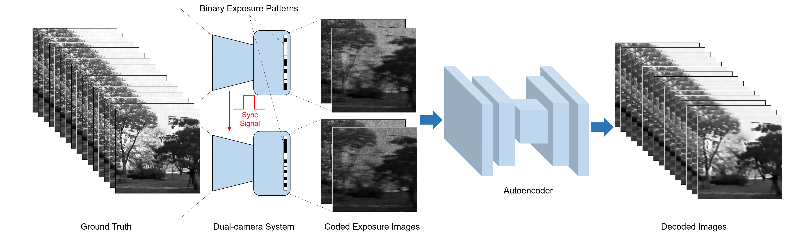

# Efficient Real-Time Video Reconstruction via CNN-Based Autoencoder for Multi-Camera Dual-Tap Coded Exposure Systems

This repository presents a **Convolutional Neural Network (CNN)-based autoencoder** designed for **multi-camera, dual-tap coded exposure systems**. The proposed approach addresses the challenges of high-speed video reconstruction by leveraging advanced deep learning techniques to optimize computational efficiency while maintaining high-quality output. 

## Key Features

- **End-to-End Optimization**: Utilizes deep learning to jointly optimize coded exposure patterns and reconstruction models.
- **Dual-Tap Coded Exposure**: Exploits complementary information from dual-tap configurations, enabling superior reconstruction quality compared to traditional single-tap methods.
- **Resource Efficiency**: Designed for low computational overhead (24.99 GFLOPs) and reduced parameter count (2.42M), making it ideal for resource-constrained edge devices.
- **Scalable Architecture**: Adaptable to multi-camera setups, enabling enhanced scene understanding and flexibility for various applications.

## System Overview

The framework integrates **dual-camera, dual-tap pixel-wise coded exposure photography** with a **convolution-based autoencoder** for high-speed video reconstruction. Key components include:

1. **Coded Exposure Modeling**: Captures motion information by modulating pixel-wise exposure patterns.
2. **Autoencoder Design**: Incorporates motion direction as a prior, with skip connections for efficient gradient flow and enhanced learning.
3. **Loss Function**: Combines Mean Squared Error (MSE), Reblur Loss, and Total Variation (TV) Loss for accurate and natural reconstruction.

<p align="center">
  
</p>

## Results

The model was trained on the **GoPro dataset** and achieved:

- **PSNR**: 25.6 dB on validation and 27.9 dB on test sets.
- **FLOPs**: 24.99 GFLOPs, reducing computational cost compared to traditional methods.
- **Parameter Count**: 2.42 million, offering a lightweight yet effective solution.

<p align="center">
  
</p>

## Applications

This framework is suitable for various **real-time computer vision applications**, including:

- **Autonomous Driving**: Captures dynamic scenes under rapid motion.
- **Video Surveillance**: Enhances clarity in high-speed monitoring.
- **Industrial Inspection**: Facilitates precision imaging in fast-paced environments.

## Running the Project

### Training
To initiate the training process, run the following command:

```bash
python train.py
```

### Testing
To evaluate the model, execute:


```bash
python test.py
``` 
